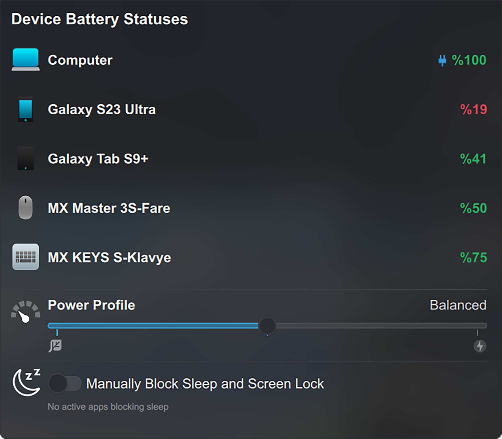
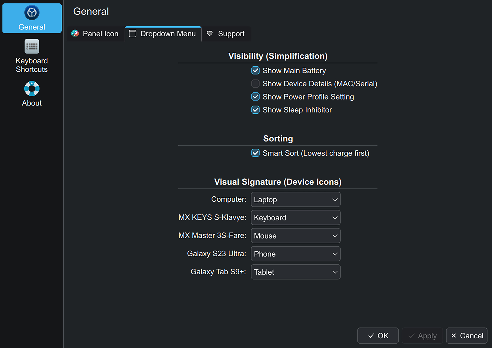
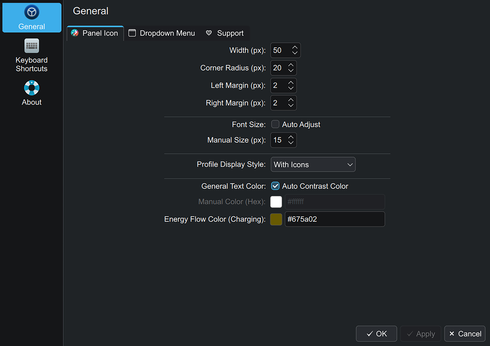

# ⚡ PowerHub - KDE Plasma 6 Widget

  

  

Manage all your devices, power profiles, and sleep status from a single, elegant point on your KDE Plasma 6 desktop. Designed by **MerchiN Studios**.

## ✨ Features

* **📱 Universal Device Monitoring:** Keep track of your Laptop, Phone (KDE Connect), Mouse, Keyboard, Gamepads, and more in one unified view.
* **🧹 Smart Sorting & Simplification:** Dynamically hides disconnected devices and sorts them intelligently by lowest charge first.
* **🎨 Custom Visual Signatures:** Assign custom icons or specific device images to match your physical hardware.
* **⚡ Power Profile Manager:** Seamlessly switch between Power Save, Balanced, and Performance modes directly from the widget.
* **🌙 Sleep Inhibitor Control:** Manually block the system from sleeping or locking, and see exactly which background apps are currently preventing sleep.

## 🌍 True Multi-Language Support

PowerHub speaks your language! The widget is fully localized and dynamically adapts to your system language. Currently supported languages include:
* 🇬🇧 English
* 🇹🇷 Turkish (Türkçe)
* 🇩🇪 German (Deutsch)
* 🇫🇷 French (Français)
* 🇪🇸 Spanish (Español)
* 🇧🇷 Portuguese (Português - BR)
* 🇷🇺 Russian (Русский)
* 🇨🇳 Chinese (Simplified - 简体中文)
* 🇯🇵 Japanese (日本語)

## 📸 Screenshots Gallery

  
<b>🖼️ Click to expand and view all widget states and settings</b>

   
  

    
    
    
    
    
    
    
    
    
  

## 🛠️ Dependencies

PowerHub dynamically adapts to your system, utilizing the following base packages depending on your Linux distribution:

* `upower` - For reading battery levels (pre-installed on almost all distros).
* `qdbus` (or `qdbus6` / `qdbus-qt6`) - For tracking KDE Connect devices.
* `power-profiles-daemon` or `tlp` - For managing power profiles.
* `systemd` or `kde-inhibit` - For the Sleep Inhibitor module.

## 🚀 Installation

### Quick Install
1. Clone or download this repository.
2. Open a terminal inside the downloaded folder.
3. Run the installation script:
> chmod +x install.sh
> ./install.sh

4. Restart your Plasma shell (or log out and log in):
> plasmashell --replace &

### Uninstallation
To completely remove the widget and its language configurations, simply run:
> chmod +x uninstall.sh
> ./uninstall.sh

## ❤️ Support
If you enjoy this widget and want to support my late-night open-source development sessions, consider buying me a coffee! 

