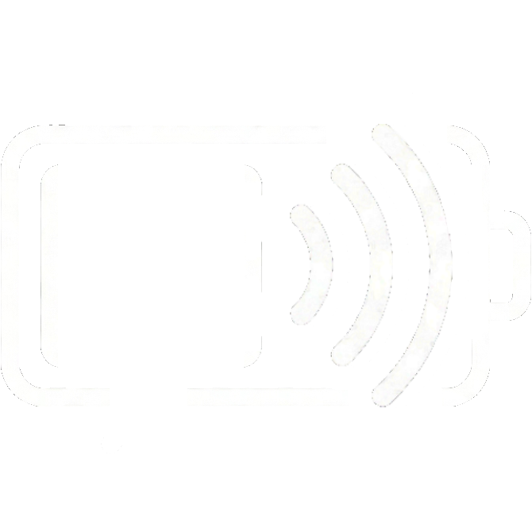

# ⚡ PowerHub - KDE Plasma 6 Widget

<a href="https://buymeacoffee.com/merchin" target="_blank"></a>

Manage all your devices, power profiles, and sleep status from a single, elegant point on your KDE Plasma 6 desktop. Designed by [MerchiN Studios](https://buymeacoffee.com/merchin).

 *(You can replace this image path with a real screenshot of the widget later)*

## ✨ Features
* **🔋 Universal Device Monitoring:** Keep track of your Laptop, Phone (KDE Connect), Mouse, Keyboard, Gamepads, and more.
* **🧠 Smart Sorting & Simplification:** Dynamically hides disconnected devices and sorts them by lowest charge first.
* **🎨 Custom Visual Signatures:** Assign custom icons or image files to your specific devices.
* **🚀 Power Profile Manager:** Seamlessly switch between Power Save, Balanced, and Performance modes (Supports both `power-profiles-daemon` and `tlp`).
* **🌙 Sleep Inhibitor Control:** Manually block the system from sleeping or locking, and see exactly which background apps are preventing sleep (Supports both `systemd-inhibit` and `kde-inhibit`).
* **🌍 Multi-Language Support:** Fully localized in English, Turkish, German, French, Spanish, Portuguese (BR), Russian, Chinese (Simplified), and Japanese.

## 📦 Dependencies
PowerHub dynamically adapts to your system, but utilizes the following base packages depending on your Linux distribution:
* `upower` - For reading battery levels (pre-installed on almost all distros).
* `qdbus` (or `qdbus6` / `qdbus-qt6`) - For tracking KDE Connect devices.
* `power-profiles-daemon` or `tlp` - For managing power profiles.
* `systemd` or `kde-inhibit` - For the Sleep Inhibitor module.

## 🛠️ Installation

### Quick Install
1. Clone or download this repository.
2. Open a terminal inside the downloaded folder.
3. Run the installation script:
```bash
chmod +x install.sh
./install.sh
```
4. Restart your Plasma shell (or log out and log in).
```bash
plasmashell --replace &
```

### Uninstallation
To completely remove the widget and its language configurations, simply run:
```bash
chmod +x uninstall.sh
./uninstall.sh
```

## ❤️ Support
If you enjoy this widget and want to support my late-night open-source development sessions, consider buying me a coffee!

<a href="https://buymeacoffee.com/merchin" target="_blank">☕ Support MerchiN</a>
